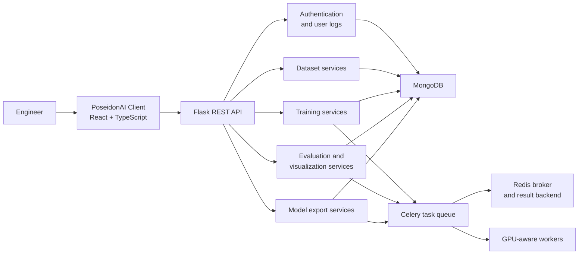

# PoseidonAI Server

PoseidonAI is an independently developed computer-vision workflow platform for managing the path from dataset preparation and training configuration to evaluation, model export, and software integration.

This repository contains the Flask backend, asynchronous task services, dataset utilities, training and evaluation logic, and model-export workflows. The web interface is maintained in [PoseidonAI Client](https://github.com/RocketWill/PoseidonAI-Client).

The platform was validated for internal engineering use across three projects and approximately 20,000 images with a small team of fewer than five users. These figures describe the verified internal scope, not enterprise-wide adoption.

## System architecture



## End-to-end workflow

```mermaid
flowchart LR
    A["Create dataset"] --> B["Upload images<br/>and annotations"]
    B --> C["Validate and<br/>inspect dataset"]
    C --> D["Create training<br/>configuration"]
    D --> E["Select algorithm<br/>and GPU"]
    E --> F["Run asynchronous<br/>training task"]
    F --> G["Evaluate model"]
    G --> H["Visualize predictions<br/>and metrics"]
    H --> I["Export model"]
    I --> J["Integrate with<br/>C++, Python, or C#"]
```



## Capabilities

| Area | Public implementation |
| --- | --- |
| User management | Registration, login, JWT authentication, profiles, and user-action logs |
| Dataset management | Dataset CRUD, image and annotation upload, dataset statistics, and visualization |
| Dataset utilities | COCO validation, annotation filtering, COCO-to-YOLO conversion, and dataset splitting |
| Training configuration | Configurable YOLOv8 and Detectron2 workflows |
| Task execution | Celery-based asynchronous execution with explicit GPU assignment and progress tracking |
| Model training | YOLOv8 classification and object detection; Detectron2 instance segmentation |
| Evaluation | Classification, detection, and instance-segmentation evaluation workflows |
| Result inspection | Prediction visualization, summary data, confidence curves, PR curves, and task results |
| Model export | Validated YOLOv8 and Detectron2 export workflows, including deployment-oriented packaging |
| Integration | Companion client guidance for C++, Python, and C# runtime integration |

## Supported computer-vision workflows

- YOLOv8 image classification
- YOLOv8 object detection
- Detectron2 instance segmentation
- COCO-based dataset preparation and validation
- GPU-aware training and evaluation task execution
- Model evaluation and prediction visualization
- Model export and deployment integration

## Technology stack

- **API:** Python, Flask, Flask-CORS
- **Authentication:** Flask-JWT-Extended
- **Database:** MongoDB, Flask-PyMongo
- **Task processing:** Celery, Redis
- **Computer vision:** Ultralytics YOLOv8, Detectron2, pycocotools, OpenCV
- **Companion frontend:** React, TypeScript, Ant Design Pro

## Repository layout

```text
PoseidonAI-Server/
├── app/        # Flask application, configuration, database, Redis, and Celery setup
├── routes/     # REST API blueprints
├── services/   # Application services and workflow coordination
├── tasks/      # Asynchronous task entry points
├── utils/
│   ├── dataset/                # Dataset validation, conversion, and visualization
│   ├── training_configuration/ # Framework-specific configuration builders
│   ├── training_task/          # Dataset preparation and model training
│   ├── evaluation_task/        # Evaluation workflows
│   ├── visualize_val/          # Prediction visualization
│   └── export_model/           # Model conversion and deployment packaging
├── requirements.txt
└── run.py
```

## API areas

The Flask application registers the following API groups:

| Prefix | Purpose |
| --- | --- |
| `/api/auth` | Registration, login, logout, and profile access |
| `/api/datasets` | Dataset lifecycle, statistics, and visualization |
| `/api/detect-types` | Supported computer-vision task types |
| `/api/dataset-formats` | Dataset-format metadata |
| `/api/training-configurations` | Training configuration lifecycle |
| `/api/training-frameworks` | Framework metadata |
| `/api/algorithms` | Algorithm metadata |
| `/api/training-tasks` | Training, evaluation, visualization, and export tasks |
| `/api/user-logs` | User-action logs |

## Local setup

PoseidonAI requires Python, MongoDB, Redis, and a Celery worker. GPU-enabled training additionally requires a compatible CUDA and framework environment.

1. Create a Python environment and install dependencies:

   ```bash
   python -m venv .venv
   source .venv/bin/activate
   pip install -r requirements.txt
   ```

2. Start MongoDB and Redis using local services or containers. Use your own credentials and do not commit them to the repository.

3. Configure the Flask application in `app/config.py` for the target environment.

4. Start the API:

   ```bash
   python run.py
   ```

5. Start a Celery worker in a separate process:

   ```bash
   celery -A run.celery worker --loglevel=info -E --concurrency=1
   ```

The current project uses application configuration rather than a complete production configuration layer. Review all paths, database settings, JWT secrets, and Redis settings before running it outside a local or controlled internal environment.

## Project scope

PoseidonAI demonstrates an internally validated, end-to-end computer-vision workflow with MLOps-oriented capabilities. It should not be interpreted as a complete enterprise MLOps suite: the public version does not claim organization-wide governance, production monitoring, model-registry automation, or large-scale multi-tenant operation.

The public repositories do not include customer datasets, proprietary models, production credentials, confidential equipment parameters, or customer-specific deployment details.

## Current limitations

- GPU selection is explicit and task-aware; the public code does not implement automatic cluster-wide resource arbitration.
- Configuration is still application-oriented and requires environment-specific review before deployment.
- The public repository does not include a complete automated test and CI baseline.
- Runtime dependencies for GPU training and model export depend on the selected framework, CUDA environment, and deployment target.

## Related repository

- [PoseidonAI Client](https://github.com/RocketWill/PoseidonAI-Client) — web interface for dataset, training, evaluation, visualization, and export workflows.

## License

No open-source license has been selected. Unless a license is added, the repository is available for viewing and evaluation but does not grant reuse rights.
